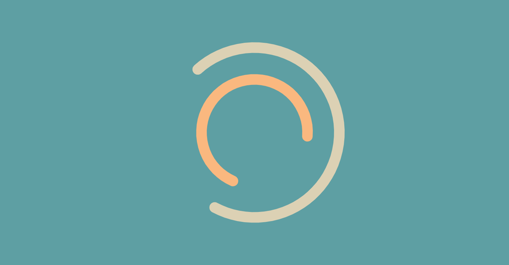
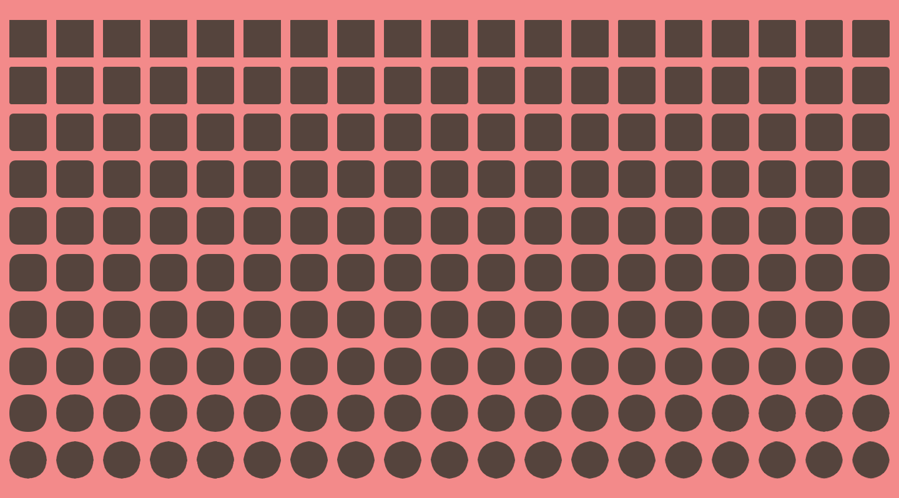
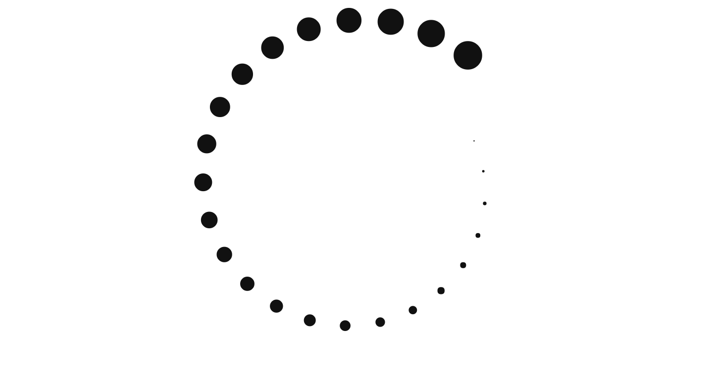

# GALLERY

All my examples can be viewed here: <https://matthijskamstra.github.io/creative-coding>.

Automaticly you will see my last sketch (an artist last work is "always" his best work...).

But when the browser has focus, you can use the cursors on your keyboard to navigate the sketches.
Use cursor `up` to start with the first sketch, use cursor `left` and `right` to go the previouse and next sketch and use the `down` cursor to go to the last sketch.

key | action
--- | ---
cursor up | goto first sketch
cursor down | goto last sketch
cursor left | goto previous sketch
cursor right | goto next sketch
cmd + s | save image as jpg
cmd + shift + s | save image as png

But here you can see the sketches that I like the most:

 
 

